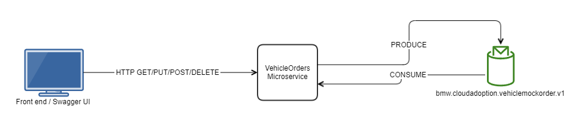

# Vehicle Order Service

This project uses Quarkus, the Supersonic Subatomic Java Framework.

If you want to learn more about Quarkus, please visit its website: https://quarkus.io/ .

## Prerequites
- Java 11
- Maven
- Docker
- Kafka (See 'Running kafka locally' section)

## Data flow


## Running kafka locally

You need Docker and docker compose installed on your machine. 

From the [local_kafka](local_kafka) folder run: 
```
docker-compose up -d
```

## Connecting to the deployed Kafka cluster

[Download the kafka binary](https://kafka.apache.org/downloads)
Create a properties file in the bin folder called sandbox-config.properties with the following:
```
bootstrap.servers=pkc-lq8gm.westeurope.azure.confluent.cloud:9092
ssl.endpoint.identification.algorithm=https
security.protocol=SASL_SSL
sasl.mechanism=PLAIN
sasl.jaas.config=org.apache.kafka.common.security.plain.PlainLoginModule required username="3LVJS32PKIBHQOMX" password="GgGhT2lm+cu1KTQWhwdJ/cOoFLchKIr1dHHaisYfsPK3J3r8+WCCc/VIowvlHCUB";
```

Run the command (in the bin folder) to consume from the topic:
```
.\kafka-console-consumer.bat --bootstrap-server pkc-lq8gm.westeurope.azure.confluent.cloud:9092 --topic bmw.cloudadoption.vehiclemockorder.v1 --consumer.config sandbox-config.properties --property print.key=true
```


## Running the application in dev mode

You can run your application in dev mode that enables live coding using:
```shell script
./mvnw compile quarkus:dev
```
Once deployed you can view the swagger page at http://localhost:8080/q/swagger-ui/

## Vehicle-order JSON

```
{
    "orderNumber": "MB25042",
    "vehicleId": "G01",
    "orderPerPlant": [
        {
            "plantId": "034.00",
            "plannedOrderStartDate": "2022-05-11",
            "plannedOrderEndDate": "2022-05-12",
            "assemblyLine": {
                "plantId": "034.00",
                "logisticLevel": "R0",
                "areaCode": "01"
            }
        }
    ]
}
```

